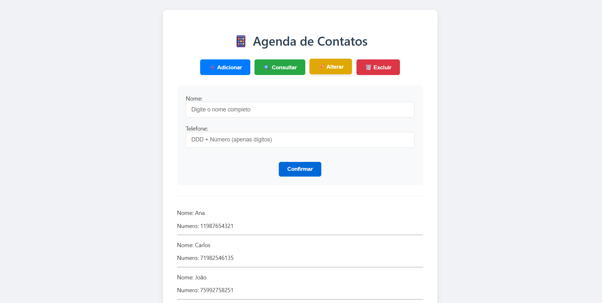

# 📱 Agenda de Contatos JS

Um sistema CRUD completo para gerenciamento de contatos telefônicos desenvolvido com JavaScript puro.

## ✨ Demonstração



## 🚀 Funcionalidades

- ✅ **CRUD Completo** (Create, Read, Update, Delete)
- 🔍 Busca instantânea de contatos
- 🔄 Ordenação automática A-Z
- 📱 Validação de números telefônicos
- 🎨 Interface intuitiva com feedback visual

## 🛠 Tecnologias


## ⚡ Como Usar

1. Clone o repositório:
```bash
git clone https://github.com/EduardoPec/agendaContatos.git
